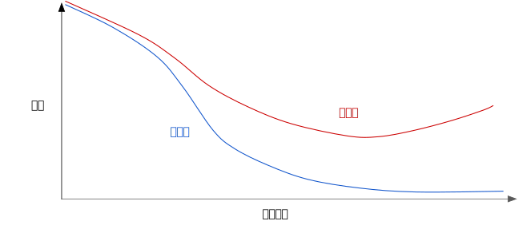
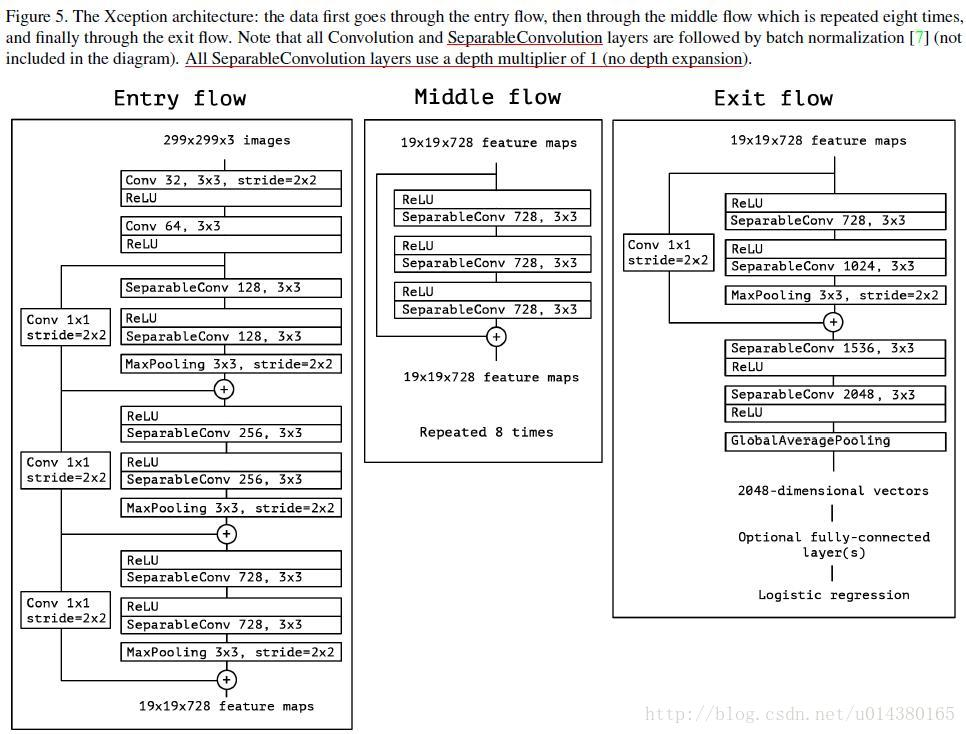

# 深度学习（神经网络）

***TODO: 目前分类杂乱，先将知识点罗列整理，后续再加以分类***

**todo list**
+ 预处理 -> 缩放 -> 帮助梯度下降更快的收敛 **WHY**

#### 神经网络并不是一个新的概念，不过，得益于近些年大数据的发展，机器性能的提升，神经网络的能力得到展现，开始成为人工智能领域的主力军。

#### 提纲
+ loss
  + 交叉熵
  + MSE
+ metrics 评价指标
+ optimizer
+ 梯度下降
+ 正则化
+ 全连接网络
+ 残差网络
+ 卷积网络
+ batch-normalize / BN
+ 1 x 1 卷积
+ 注意力机制
+ 监督
+ 自监督
+ 迁移学习
+ 强化学习
+ 生成对抗网络
+ 循环网络
+ 分类
+ 回归
+ 图像识别
+ 图像检测
+ 图像分割
+ C3D 
+ one-hot编码
+ 词袋模型
+ 论文 
+ 征引


# 正文

## 评价指标

### 分类器的评价指标

***

#### 混淆矩阵 confusion matrix

以二分类为例：


***

#### Accuracy, Recall, Precison, Specificity, F1
#### 准确率，召回率，精度，特异度，F1, F${_\beta}$

$Accuray = \frac{(TP + TN)}{(TP + TN + FN + TN)}$

$Recall = \frac{TP}{TP + FN}$

$Precision = \frac{TP}{TP + FP}$

$Specificity = \frac{TN}{TN + FN}$ 

$F1 = \frac{2 \times (Precision \times Recall)}{Precision + Recall}=\frac{2*TP}{2*TP+FN+FP}$

>关于F1：
>F1是Precision和Recall的调和平均数(倒数算术平均数的倒数),
>调和平均数的特点是强调小元素，忽略大元素。
>如果一个分类器的F1很高，则该分类器的Precision和Recall一定同时很高。
>如果Recall很大，Precision很小，那么F1的值也是很小的
>极端来说，如果Recall=1，Precision=0，此时F1=0
>
> 后面我们会看到**Dice**，事实上，Dice等同与F1

$F_{\beta} = \frac{((1 + (\beta)^{2}) \times (Precision \times Recall)}{((\beta)^{2} \times Precision) + Recall}$

$F_{\beta}$的使用场景出现在，当你对Precision和Recall中某一个指标更感兴趣时。如果你更看重Precision，那么${\beta}$的值应该小于1，如果你更看重Recall，那么${\beta}$的值应该大于1.

***

#### ROC
Receiver Operating Characteristic Curve
最初是为军事雷达接收器的操作者设计的，所以如此命名。

横坐标为 伪阳性率(FPR, False Positive Rate)
$FPR = \frac{FP}{N} = \frac{FP}{FP + TN}$

纵坐标为 真阳性率(TPR，Ture Positive Rate)(Recall)
$TPR = \frac{TP}{P} = \frac{TP}{TP + FN}$

ROC曲线用于绘制采用不同分类阈值时的TPR与FPR。降低分类阈值，会有更多样本被划分为Positive.假正例与真正例都会增加。所以曲线从左向右呈现攀升趋势。
理想情况下，ROC曲线为一点 (0, 1)
<!--  -->


#### AUC
Area Under the Curve
<!--  -->


曲线下面积对所有可能的分类阈值的效果进行综合衡量。曲线下面积的一种解读方式是看作模型将某个随机正类别样本排列在某个随机负类别样本之上的概率。

>理论公式如下:
>$$TPR(T): T \rightarrow y(x)$$
>$$FPR(T): T \rightarrow x$$
>
>$T$为选取的阈值，$X_1$为一个随机正例的预测得分，$X_0$为一个随机负例的预测得分。$f_1, f_0$分别是正例和负例的概率密度。


以下面的样本为例，逻辑回归预测从左到右以升序排列：


曲线下面积表示随机正类别（绿色）样本位于随机负类别（红色）样本右侧的概率。
曲线下面积的取值范围为 0-1。预测结果 100% 错误的模型的曲线下面积为 0.0；而预测结果 100% 正确的模型的曲线下面积为 1.0。

##### AUC的计算
+ 根据古典概率模型
  $AUC = \frac{\sum{(sign(pred_{pos} - pred_{neg})} / 2 + 0.5)}{positiveNum \times negativeNum}$
  即，统计所有可能的组合情况（两两组合）
+ Rank
  $AUC = \frac{\sum_{ins_i\in{positiveClass}}{rank_{ins_i}-\frac{M\times(M+1)}{2}}}{M\times N}$
  $rank_{ins_i}$: 概率得分从小到大排序，正样本$ins_i$在排序后的排名
  $M, N$: 分别是正样本和负样本的个数
  
  注：对于概率相等的样本，他们的$rank$统一为他们的$rank$均值

>关于 Rank 方法
从小到大排序后，第一个正样本的位置（rank，假设从0开始），就是其比负样本得分大的个数；对于第二个正样本，前面有已经1个正样本了，所以负样本个数为rank减1，同理，第三个正样本前面的负样本个数为位置减去2，以此类推，对于第M个正样本，匹配的负样本个数为位置序号减去(M-1)。 故而，分子就变成: 所有正样本的位置序号和，减去$(0+1+2+\dots+M-1)=M*(M-1)/2$.
若序号从1开始，则减数为：$(0+1+2+\dots+M-1)=M*(M-1)/2$

> 如果我们的数据中类别分布非常不均衡的时候，ROC就不再适用了．在负样本分布远多于正样本情况下，更倾向于使用PR曲线。


***
#### AP, mAP
目标检测中的常用评价指标，计算方法如下。当预测的包围盒和真实包围盒的交并比大于某一阈值(通常为0.5)，则认为该预测正确。对每个类别，我们画出它的`PR`曲线: 查准率-查全率(precision-recall)曲线，平均准确率是曲线下的面积。之后再对所有类别的平均准确率求平均，即可得到mAP，其取值为[0, 100%]

##### AP(Average Precision)
顾名思义AP就是平均精准度，简单来说就是对PR曲线上的Precision值求均值。对于pr曲线来说，我们使用积分来进行计算。

$$ AP = \int_0^1{p(r)dr}$$

在**实际应用**中，我们并不直接对该PR曲线进行计算，而是先对PR曲线进行**平滑处理**：对PR曲线上的每个点，Precision的值取该点右侧最大的Precision的值。


用公式描述为：
$$ P_{smooth}(r) = max_{r^{\prime}>=r}P(r^{\prime})$$
> 之后，所有计算基于平滑后的PR曲线

##### Interplolated AP（Pascal Voc 2008 的AP计算方式）
Pascal VOC 2008中设置IoU的阈值为0.5，如果一个目标被重复检测，则置信度最高的为正样本，另一个为负样本。在平滑处理后的PR曲线上，取横轴0-1的10等分点（包括断点共11个点）的Precision的值，计算其平均值为最终AP的值。
$$ AP = \frac{1}{11}\sum_{0,0.1...1.0}P_{smooth}(i) $$

##### Area under curve
上述方法有两个缺陷，第一个是使用11个采样点在精度方面会有损失。第二个是，在比较两个AP值较小的模型时，很难体现出两者的差别。所以这种方法在2009年的Pascalvoc之后便不再采用了。在Pascal voc 2010之后，便开始采用这种精度更高的方式。绘制出平滑后的PR曲线后，用积分的方式计算平滑曲线下方的面积作为最终的AP值
$$ AP = \int_0^1p_smooth(r)dr$$

##### COCO mAP
最新的目标检测相关论文都使用coco数据集来展示自己模型的效果。对于coco数据集来说，使用的也是Interplolated AP的计算方式。与Voc 2008不同的是，为了提高精度，在PR曲线上采样了**100**个点进行计算。而且Iou的阈值从固定的0.5调整为在 0.5 - 0.95 的区间上每隔0.5计算一次AP的值，取所有结果的平均值作为最终的结果。

比如我们看一下YOLOv3的作者在论文中展示的在coco数据集上的实验结果


> 注：通常来说AP是在单个类别下的，mAP是AP值在所有类别下的均值。在这里，在coco的语境下AP便是mAP，这里的AP已经计算了所有类别下的平均值，这里的AP便是mAP。


***
#### PR 曲线
以precision为纵坐标，recall为横坐标的曲线
在负样本远多于正样本情况下，相比于ROC，应当选择PR曲线


> **定理1**：对于一个给定的包含正负样本的数据集，ROC空间和PR空间存在一一对应的关系，也就是说，如果recall不等于0，二者包含完全一致的混淆矩阵。我们可以将ROC曲线转化为PR曲线，反之亦然。
> **定理2**：对于一个给定数目的正负样本数据集，一条曲线在ROC空间中比另一条曲线有优势，当且仅当第一条曲线在PR空间中也比第二条曲线有优势。（这里的“一条曲线比其他曲线有优势”是指其他曲线的所有部分与这条曲线重合或在这条曲线之下。）


***
#### PA MPA mIoU FWIoU 
##### 图像分割领域的常用指标：


***
#### Log loss - Cross entropy
用于**分类**(**逻辑回归**)（逻辑回归的输出为概率，这使得我们联想到Log loss与概率之间的关系）

> **逻辑回归**
> 逻辑回归在输出层加入S型函数，将输出映射到[0,1]的概率空间。
> 典型的S型函数如下：
> $$y^{\prime}=\frac{1}{1+e^{-z}}$$

**熵**：信息论中，一个随机变量的熵衡量它具有的"信息"量（不确定性）
一个随机变量$X$,具有可能的取值$x_1, \dots, x_n$,对应的取值概率分别为$P(x_1), \dots, P(x_n)$,则$X$的熵为：

$H(x)=-\sum_{i=1}^{n}{P(x_i)log_bP(x_i)}$

**交叉熵**：
假设$p, q$是具有相同取值范围的两个离散概率分布，则$p, q$的交叉熵为：

$H(p,q)=H(p)+D_{KL}(p||q)=-\sum_{x \in \chi}{p(x)logq(x)}; \chi 为取值范围$

机器学习二分类问题下可以写成如下形式：
$H(y,p)=-(ylogp + (1-y)log(1-p))$

>两种角度看待交叉熵
从似然函数角度看，最大化似然函数就是交叉熵
从分布角度来看，我们希望最小化模型输出与训练集标签之间的分布差异，当我们用KL散度来度量分布时，即是最小化$D_{KL}(p||q)$,考虑到$H(p)$是常量，最小化$D_{KL}$,也就是最小化$H(p,q)$

>分类问题中，使用cross entropy 相比于 MSE 的优点：
使用MSE计算loss，loss的曲线是波动的，有很多局部的极值点，是一个非凸优化问题，不利于梯度下降
而cross entropy 作为loss，依然是一个凸优化问题，梯度下降时，具有很好的收敛特性。

***
##### BCELoss
Binary Cross Entropy Loss
将交叉熵用于二分类时的形式。
$$\ell(x, y) = L = \{l_1,\dots,l_N\}^\top, \\
    l_n = - w_n \left[ y_n \cdot \log (x_n)
    + (1 - y_n) \cdot \log (1 - x_n) \right]$$
$$\ell(x, y) = \begin{cases}
            \operatorname{mean}(L), & \text{if reduction} = \text{'mean';}\\
            \operatorname{sum}(L),  & \text{if reduction} = \text{'sum'.}
        \end{cases}\\
    N: batch\ size,\quad x:pred, \quad y:label$$

> **梯度无穷大问题：**
> 在实现上，如果$x_n$的值为0或者1，或产生$log(0)$项，$\lim_{x\rightarrow0}=-\infty$，此时，梯度趋于无穷大：$\lim_{x\rightarrow 0}\frac{d}{dx}log(x)=\infty$
> 在Pytorch中，BCELoss被限制在大于等于-100的范围内，这样就避免了出现无穷大梯度的情况。

**refer:**
[torch.nn.BCELoss(weight: Optional[torch.Tensor] = None, size_average=None, reduce=None, reduction: str = 'mean')](https://pytorch.org/docs/stable/generated/torch.nn.BCELoss.html)
<br>

##### BCEWithLogitsLoss
Pytorch中将sigmoid和BCELoss（Binary Cross Entropy）放在一层实现的函数，比先做Sigmoid，再做BCELoss更稳定（就计算机的计算而言），因为一起计算时可以使用log-sum-exp的数学技巧。

$$\ell(x, y) = L = \{l_1,\dots,l_N\}^\top, \\
    l_n = - w_n \left[ y_n \cdot \log \sigma(x_n)
    + (1 - y_n) \cdot \log (1 - \sigma(x_n)) \right]$$
$$\ell(x, y) = \begin{cases}
            \operatorname{mean}(L), & \text{if reduction} = \text{'mean';}\\
            \operatorname{sum}(L),  & \text{if reduction} = \text{'sum'.}
        \end{cases}\\
    N: batch\ size,\quad \sigma: sigmoid \; function\\
    x: pred, \quad y: label$$


***
#### 最大似然概率


***
#### 马尔可夫模型


***
### 回归任务的评价指标

#### MSE 均方差
均方误差 (MSE) 指的是每个样本的平均平方损失。要计算 MSE，需要求出各个样本的所有平方损失之和，然后除以样本数量。
$$MSE=\frac{1}{N}\sum_{(x,y)\in D}{(y-prediction(x))^2}$$
其中
+ $(x,y)$指的是样本，其中
  + $x$指的是模型进行预测时使用的特征集（例如，温度、年龄和交配成功率）。
  + $y$指的是样本的标签（例如，每分钟的鸣叫次数）。
+ $prediction(x)$指的是权重和偏差与特征集$x$结合的函数,可看作$f(x)$。
+ $D$指的是包含多个有标签样本的数据集。
+ $N$指的是$D$中的样本数量。

虽然 MSE 常用于机器学习，但它既不是唯一实用的损失函数，也不是适用于所有情形的最佳损失函数。


***
#### 范数
我们这里说的**特指$L_p$范数**

$$p=-\infty : ||\vec x||_{-\infty}=\lim_{p\rightarrow -\infty}(\sum_{i=1}^{n}|x_i|^p)^{1/p}=\min_{i}|x_i|$$
$$p=0: ||\vec x||_0=\sharp(i), with x_i \neq 0, \ i.e.向量中不为零的元素个数$$
$$p=1: ||\vec x||_1 = \sum_{i=1}^{n}|x_i|,\ i.e. 向量各分量绝对值之和，又称曼哈顿距离$$
$$p=2: ||\vec x||_2 =\sqrt{\sum_{i=1}^{n}{|x_i|^2}},\ i.e. 欧氏距离$$
$$p=+\infty : ||\vec x||_{+\infty}=\lim_{p\rightarrow +\infty}(\sum_{i=1}^{n}|x_i|^p)^{1/p}=\max_{i}|x_i|$$

***
#### 正则化
正则化的出现是为了抑制模型的过拟合

以线性模型为例，用多项式拟合目标函数时，多项式的最高次数越大，训练集loss越小，但测试集loss反而可能增大，此时出现了过拟合。这也同样印证了奥卡姆剃刀理论，模型越复杂，越可能出现过拟合。
使用正则化抑制参数的值，理想情况下，它使得多项式中高次数的项的系数趋于0，从而降低模型复杂度，也即抑制了过拟合

另一种情形是，模型迭代次数过多，学习了过多训练集样本的特定特征，从而产生过拟合。如下图：



现在，我们不仅以最小化loss为目标，我们以同时最小化loss和模型复杂度为目标。而模型复杂度的表示项即为我们的正则化项。

##### L2正则化
L2正则化是一种常用的正则化项，其定义为所有特征权重的平方和：
$$L_2\ regularization\ term=||\omega||_2^2=\omega_1^2+\omega_2^2+\dots + \omega_n^2$$

在这个公式中，接近于 0 的权重对模型复杂度几乎没有影响（可以理解为模型近似去除了该参数,**需要注意的是，L2正则化可以使权重变小，但是并不能使它们正好为0.0**），而值较大权重则可能会产生巨大的影响
加入L2正则化后，模型在训练中会倾向于偏好参数较小的模型，从而降低模型复杂度。

##### L1正则化
L1正则项可以使得部分权重正好为0.0

> 注：**为什么L2正则项不能是权重为0.0**
> * 举例而言，L2正则项中关于权重$\omega_i$为$\omega_i^2$,其导数（梯度）为$2\omega_i$,这意味着，每次更新权重，$\omega_i$都改变自身比例的某个值$step\times 2\omega_i=(1-step\times 2)\omega_i$，所以权重可能会接近0，但永远不会真正为0.0（除非$step=0.5$，或是$\omega_i$在更新后太大或太小，导致计算机float类型越界）
> * 而L1正则项的梯度为常数，权重每次减去一个常数，当更新后由大于零的状态变为小于零的状态，该权重就被置零。

> 注：
> **L1正则项有利于得到稀疏解，L2正则项有利于得到平滑解。**

##### Lambda系数
可以通过在正则化项前添加Lambda系数来控制正则化强度。

在选择 lambda 值时，目标是在简单化和训练数据拟合之间达到适当的平衡：
+ 如果您的 lambda 值过高，则模型会非常简单，但是您将面临数据欠拟合的风险。您的模型将无法从训练数据中获得足够的信息来做出有用的预测。

+ 如果您的 lambda 值过低，则模型会比较复杂，并且您将面临数据过拟合的风险。您的模型将因获得过多训练数据特点方面的信息而无法泛化到新数据。

> 注：将 lambda 设为 0 可彻底取消正则化。 在这种情况下，训练的唯一目的将是最小化损失，而这样做会使过拟合的风险达到最高。

##### 早停法
另一种正则化方法，在训练损失仍可以继续降低之前就结束模型训练。一般在验证集的损失开始增大（也就是泛化效果变差）时结束模型训练。


***
### 梯度, 学习速率
函数的梯度是偏导数相对于所有自变量的矢量，表示如下：
$$\nabla f$$
例如，如果：
$$f(x,y)=e^{2y}sin(x)$$
则：
$$\nabla f(x,y)=(\frac{\partial f}{\partial x}(x,y),\frac{\partial f}{\partial y}(x,y))=(e^{2y}cos(x),2e^{2y}sin(x))$$
> 注意
> $\nabla f$ 指向函数增长速度最快的方向
> $-\nabla f$ 指向函数下降速度最快的方向 
 
对于神经网络而言，每层的参数即为变量，模型的输入(样本)为常量，一般而言，在每个batch后，求出loss对参数的梯度，取负梯度方向按照一定的学习率更新参数，使得在给定输入(样本)的情况下，loss减小，循环迭代，找到使得训练集样本的loss最小的参数。

#### 学习速率 learning rate(lr)
梯度下降法算法用梯度乘以一个称为学习速率（有时也称为步长）的标量，以确定下一个点的位置。例如，如果梯度大小为 2.5，学习速率为 0.01，则梯度下降法算法会选择距离前一个点 0.025 的位置作为下一个点。

学习速率属于**超参数**
> 超参数
> 编程人员根据情况手动设置的模型参数，非模型自己学习的参数
> 包括，学习速率，模型深度等

如果选择的学习速率过小，每次参数的更新会很小，就会花费太长的学习时间
相反，如果指定的学习速率过大，下一个点将永远在 U 形曲线的底部左右弹跳
如果可以知晓损失函数的梯度较小，则可以放心地试着采用更大的学习速率，以补偿较小的梯度并获得更大的步长，从而加快模型的训练。

#### SGD 随机梯度下降
在原始的梯度下降法中，是在整个数据集上计算梯度，即将数据集中的每个样本输入模型，计算出整个数据集的loss，然后计算梯度，接着更新参数。然而，现实中，数据集往往非常庞大，计算一次梯度的时间/算力开销都很大。

由此，引出随机梯度下降法。

每次从数据集中随机选择一个样本，计算该样本在当前参数下的loss，得到梯度，更新模型参数，重复此过程，循环迭代。
SGD在更新参数过程中，由于某些样本可能存在噪声/偏差，导致该次梯度方向与总体目标方向存在偏差，使得梯度下降更新参数的过程变得杂乱。但只要进行足够多的迭代，梯度整体还是会朝向正确的方向更新参数。
“随机”这一术语表示构成各个批量的一个样本都是随机选择的。

由于SGD的下降过程杂乱，引入**batch SGD**的概念

小批量随机梯度下降法（小批量 SGD）是介于全批量迭代与 SGD 之间的折衷方案。小批量通常包含 10-1000 个随机选择的样本。小批量 SGD 可以减少 SGD 中的杂乱样本数量，但仍然比全批量更高效。

***
### 优化器 Optimizer

#### RMSprop


***
#### 奥卡姆剃刀
奥卡姆的威廉是 14 世纪一位崇尚简单的修士和哲学家。他认为科学家应该优先采用更简单（而非更复杂）的公式或理论。奥卡姆剃刀定律在机器学习方面的运用如下：
> 机器学习模型越简单，良好的实证结果就越有可能不仅仅基于样本的特性。

现今，奥卡姆剃刀定律已被正式应用于**统计学习理论**和**计算学习理论**领域。这些领域已经形成了泛化边界，即统计化描述模型根据以下因素泛化到新数据的能力：

> 模型的复杂程度
> 模型在处理训练数据方面的表现

#### 泛化
以下三项基本假设阐明了泛化：

+ 我们从分布中随机抽取独立同分布 (i.i.d) 的样本。换言之，样本之间不会互相影响。（另一种解释：i.i.d. 是表示变量随机性的一种方式）。
+ 分布是平稳的；即分布在数据集内不会发生变化。
+ 我们从同一分布的数据划分中抽取样本。

在实践中，我们有时会违背这些假设。例如：

+ 想象有一个选择要展示的广告的模型。如果该模型在某种程度上根据用户以前看过的广告选择广告，则会违背 i.i.d. 假设。
+ 想象有一个包含一年零售信息的数据集。用户的购买行为会出现季节性变化，这会违反平稳性。

如果违背了上述三项基本假设中的任何一项，那么我们就必须密切注意指标。

#### 训练集，验证集，测试集
将数据集划分为训练集和测试集。借助这种划分，您可以对一个样本集进行训练，然后使用不同的样本集测试模型。采用两种分类之后，工作流程可能如下所示：


在图中，“调整模型”指的是调整您可以想到的关于模型的任何方面，从更改学习速率、添加或移除特征，到从头开始设计全新模型。该工作流程结束时，您可以选择在测试集上获得最佳效果的模型。

但是当多次在测试集上进行测试，并根据测试集上的表现来调整模型，就意味着模型可能会**学到/猜到测试集的样本特征**，此时，测试集就不能代表模型的泛化效果。模型的效果也只能是在训练集和测试集构成的样本集上的特异化表现。

因而，我们需要引入**验证集**。

使用验证集评估训练集的效果。然后，在模型“通过”验证集之后，使用测试集再次检查评估结果。下图展示了这一新工作流程：


在这一经过改进的工作流程中：

+ 选择在验证集上获得最佳效果的模型。
+ 使用测试集再次检查该模型。

该工作流程之所以更好，原因在于它暴露给测试集的信息更少。测试集的效果更能反应模型的泛化能力。

> 注:
> 不断使用测试集和验证集会使其逐渐失去效果。也就是说，使用相同数据来决定超参数设置或其他模型改进的次数越多，您对于这些结果能够真正泛化到未见过的新数据的信心就越低。请注意，验证集的失效速度通常比测试集缓慢。
> 如果可能的话，建议收集更多数据来“刷新”测试集和验证集。

***
## 预处理
***良好的机器学习依赖于良好的数据。对数据的预处理往往比预计的更重要。***
### One Hot
将字符串映射到数字表示

样本的某个特征可能是字符串形式的离散变量。举例而言，可能有一个名为 street_name 的特征，其中的选项包括：

{'Charleston Road', 'North Shoreline Boulevard', 'Shorebird Way', 'Rengstorff Avenue'}

由于模型不能将字符串与学习到的权重相乘，需要将字符串映射为数字。

最直观的一个想法是构建一个词汇表，表中规定了特征取值到整数的映射。另外，将词汇表之外的取值定义为 OOV（out of vacabulary）。

通过这种方法，我们可以按照以下方式将街道名称映射到数字：

将 Charleston Road 映射到 0
将 North Shoreline Boulevard 映射到 1
将 Shorebird Way 映射到 2
将 Rengstorff Avenue 映射到 3
将所有其他街道 (OOV) 映射到 4

然而，这种方法显然存在问题。

+ 假设，我们学习到对于 street_name 的一个参数的权重为 6，那么对于 Charleston Road，我们会将其乘以 0，对于 North Shoreline Boulevard 则乘以 1，对于 Shorebird Way 则乘以 2，依此类推。以某个使用 street_name 作为特征来预测房价的模型为例。根据街道名称对房价进行线性调整的可能性不大，此外，这会假设您已根据平均房价对街道排序。我们的模型需要灵活地为每条街道学习不同的权重，这些权重将添加到利用其他特征估算的房价中。
+ 我们没有将 street_name 可能有多个值的情况考虑在内。例如，许多房屋位于两条街道的拐角处，因此如果模型包含单个索引，则无法在 street_name 值中对该信息进行编码。

由此，引入one hot/ multi-hot 编码

创建一个长度等同词汇表大小的向量，对每个样本，将向量中对应元素位置置1，其他位置置0

当只有一个值为 1 时，这种表示法称为One Hot编码；当有多个值为 1 时，这种表示法称为Multi-Hot编码。

> #### **特征组合**
> 在实践中，机器学习模型很少会组合连续特征。不过，机器学习模型却经常组合One Hot特征矢量，将独热特征矢量的特征组合视为逻辑连接。
> 假设我们具有以下两个特征：国家/地区和语言。对每个特征进行独热编码会生成仅具有0,1元素的二元矢量，这些二元特征可解读为 country=USA, country=France 或 language=English, language=Spanish。然后，如果您对这些独热编码进行特征组合(相乘,笛卡尔乘积)，则会得到可解读为逻辑连接的二元特征，如下所示：
> country:usa AND language:spanish


#### 特殊值
##### 实际数据内不要掺入特殊值
良好的浮点特征不包含超出范围的异常断点或特殊的值。例如，假设一个特征具有 0 到 1 之间的浮点值。那么，如下值是可以接受的：

> quality_rating: 0.82
> quality_rating: 0.37

不过，如果用户没有输入 quality_rating，则数据集可能使用如下特殊值来表示不存在该值：

> quality_rating: -1

为解决特殊值的问题，需将该特征转换为两个特征：

> 一个特征只存储质量评分，不含特殊值。
> 一个特征存储布尔值，表示是否提供了 quality_rating。为该布尔值特征指定一个名称，例如 is_quality_rating_defined。

#### 数据缩放
如果某个特征集只包含一个特征，则缩放可以提供的实际好处微乎其微或根本没有。不过，如果特征集包含多个特征，则缩放特征可以带来以下优势：

+ 帮助梯度下降法更快速地收敛。（**why**）
+ 帮助避免“NaN 陷阱”。在这种陷阱中，模型中的一个数值因为过大或过下而变成 NaN（例如，当某个值在训练期间超出浮点精确率限制时），并且模型中的所有其他数值最终也会因数学运算而变成 NaN。
+ 帮助模型为每个特征确定合适的权重。如果没有进行特征缩放，则模型会对范围较大的特征投入过多精力。

事实上，并**不需要**对每个浮点特征进行**完全相同**的缩放。即使特征 A 的范围是 -1 到 +1，同时特征 B 的范围是 -3 到 +3，也不会产生什么恶劣的影响。不过，如果特征 B 的范围是 5000 到 100000，模型可能会出现糟糕的响应。

##### 缩放方法
> 一种显而易见的方法是将 [最小值，最大值] 以线性方式映射到较小的范围，例如 [-1，+1]。
> 另一种热门的缩放策略是计算每个值的 Z score。Z score与距离均值的标准偏差相关。换而言之：
> 例如，给定以下条件：
> 均值 = 100
> 标准偏差 = 20
> 原始值 = 130
> 则：
    
    scaled_value = (130 - 100) / 20
    scaled_value = 1.5

>使用 Z 得分进行缩放意味着，大多数缩放后的值将介于 -3 和 +3 之间，而少量值将略高于或低于该范围。

#### 离群值
对于极端的离群值，可以采用取对数或是直接限制范围的方法
> 限制范围
> 比如，将数据范围限制为[-5, 5],那么任意大于5的值都被认定为5，同样，小于-5的值被认定为-5

#### 分箱
下面的曲线图显示了加利福尼亚州不同纬度的房屋相对普及率。注意集群 - 洛杉矶大致在纬度 34 处，旧金山大致在纬度 38 处。


每个纬度的房屋数曲线图。曲线图极其不规则，在纬度 36 左右出现低谷，并在纬度 34 和 38 左右出现巨大峰值。

在数据集中，latitude 是一个浮点值。不过，在我们的模型中将 latitude 表示为浮点特征没有意义。这是因为纬度和房屋价值之间**不存在线性关系**。例如，纬度 35 处的房屋并不比纬度 34 处的房屋贵 35/34（或更便宜）。但是，纬度或许能很好地预测房屋价值。

为了将纬度变为一项实用的预测指标，我们对纬度“分箱”，如下图所示：


我们现在拥有 11 个不同的布尔值特征（LatitudeBin1、LatitudeBin2、…、LatitudeBin11），而不是一个浮点特征。拥有 11 个不同的特征有点不方便，因此我们将它们统一成一个 11 元素矢量。这样做之后，我们可以将纬度 37.4 表示为：

    [0, 0, 0, 0, 0, 1, 0, 0, 0, 0, 0]

分箱之后，我们的模型现在可以为每个纬度学习完全不同的权重。

> **分箱的方法**
> 为了简单起见，我们在纬度样本中使用整数作为分箱边界。如果我们需要更精细的解决方案，我们可以每隔 1/10 个纬度拆分一次分箱边界。添加更多箱可让模型从纬度 37.4 处学习和维度 37.5 处不一样的行为，但前提是每 1/10 个纬度均有充足的样本可供学习。
> 另一种方法是按分位数分箱，这种方法可以确保每个桶内的样本数量是相等的。按分位数分箱完全无需担心离群值。

***
## 神经网络


#### 激活函数 。。。
如果没有激活函数，单纯的叠加神经网络层数（全连接），得到的只是一个复杂的线性网络，只能描述输入与输出之间的线性关系，等同于线性回归。

为了描述真实世界里更为广泛的非线性关系，引入非线性的激活函数。

假设$\sigma$表示我们的激活函数（ReLU、S 型函数等等）, 则网络中节点的值可由以下公式指定：
$$\sigma(w\cdot x + b)$$

**Sigmoid函数**
$$F(x)=\frac{1}{1+e^{-x}}$$


**tanh函数**
$$tanh(x) = 2sigmoid(2x) - 1,\ -\infty<x<+\infty, \ -1<tanh(x)<1$$
从图形上看，tanh是对sigmoid进行了变换: 水平方向压缩，垂直方向拉伸


tanh与sigmoid形式类似，优点是中心区域梯度更不容易消失


**ReLU函数**
$$F(x)=max(0,x)$$


ReLU 的优势在于它拥有更实用的响应范围。S 型函数的响应性在两端相对较快地减少。

* ReLU的导数为符号函数sgn。ReLU函数和它的导数计算简单，在正向传播和反向传播时都减少了计算量。
* 由于在$x>0$时函数的导数值为1，因而可以在一定程度上解决梯度消失问题，训练时有更快的收敛速度。
* 而当函数值为0时，会使得一些神经元的输出值为0，从而让网络变得更稀疏，起到了类似L1正则化的作用，也可以在一定程度上缓解过拟合。

***
## 反向传播中存在的注意点

### 梯度消失
较低层（更接近输入）的梯度可能会变得非常小。在深度网络中，计算这些梯度时，可能涉及许多小项的乘积。
当较低层的梯度逐渐消失到 0 时，这些层的训练速度会非常缓慢，甚至不再训练。

> 以sigmoid激活函数为例，sigmoid(x)关于x的导数的值域为[0,0.2]; 网络每加深一层，每多一层激活层，第$j$层第$i$个权重$\omega_i^j$在反向传播时都会多乘以一次[0, 0.2]的梯度（链式求导法则），该权重的梯度都会变小。

ReLU 激活函数有助于防止梯度消失。

### 梯度爆炸 。。。
如果网络中的权重过大，则较低层的梯度会涉及许多大项的乘积。在这种情况下，梯度就会爆炸：梯度过大导致难以收敛。

**Batch Normalization(BN)** 可以降低学习速率，因而有助于防止梯度爆炸。

### Batch Normalization (BN) 。。。
... ...

### ReLU 单元消失
一旦 ReLU 单元的加权和低于 0，ReLU 单元就可能会停滞。它会输出对网络输出没有任何贡献的 0 激活，而梯度在反向传播算法期间将无法再从中流过。由于梯度的来源被切断，ReLU 的输入可能无法作出足够的改变来使加权和恢复到 0 以上。

降低学习速率有助于防止 ReLU 单元消失。

### Drop Out(丢弃正则化) 。。。
随机丢弃某些网络单元，这样做的好处是：
1. 降低模型复杂度
2. 相当于训练了多个模型（丢弃不同的cell，形成了不同的网络结构），最终的输出是多个模型的组合结果。而我们知道，联合多个模型的好处是，抑制单个模型学习到的特异化知识，从而提高泛化能力。
   
通常设置一个丢弃比例：
* 0.0 = 无丢弃正则化。
* 1.0 = 丢弃所有内容。模型学不到任何规律。
* 0.0 和 1.0 之间的值更有用。


***
## 多分类任务

### Softmax
**逻辑回归**可生成介于 0 和 1.0 之间的小数。例如，某电子邮件分类器的逻辑回归输出值为 0.8，表明电子邮件是垃圾邮件的概率为 80%，不是垃圾邮件的概率为 20%。很明显，一封电子邮件是垃圾邮件或非垃圾邮件的概率之和为 1.0。

Softmax 将这一想法延伸到多类别领域。也就是说，在多类别问题中，Softmax 会为每个类别分配一个用小数表示的概率。这些用小数表示的概率相加之和必须是 1.0。
与其他方式相比，这种附加限制有助于让训练过程更快速地收敛。

Softmax 方程式如下所示：
$$p(y=j|x) = \frac{e^{w^T_jx+b_j}}{\sum_{k\in K}e^{w^T_kx+b_k}}$$
请注意，此公式**本质上是将逻辑回归公式延伸到了多类别**。

#### Softmax 变种
* **Full Softmax** 是我们一直以来讨论的 Softmax；也就是说，Softmax 针对每个可能的类别计算概率。

* **候选采样**指 Softmax 针对所有正类别标签计算概率，但仅针对负类别标签的随机样本计算概率。例如，如果我们想要确定某个输入图片是小猎犬还是寻血猎犬图片，则不必针对每个非狗狗样本提供概率。

类别数量较少时，完整 Softmax 代价很小，但随着类别数量的增加，它的代价会变得极其高昂。候选采样可以提高处理具有大量类别的问题的效率。

> **注意多标签分类情况**
> Softmax **假设每个样本只是一个类别的成员**。但是，一些样本可以同时是多个类别的成员。对于此类示例：
> * 不能使用 Softmax。
> * 必须依赖多个逻辑回归。

### Dice-coefficient Loss
Dice相似系数用来描述**两个集合之间的相似度**。
假设有集合$A$, $B$
$$Dice(A,B)=2*\frac{|Intersection(A,B)|}{|A|+|B|}\\
|A|\; means\; number\; of\; elements\; in\; set\; A$$
Dice也可以用TP,FP,FN来描述：
$$Dice(A,B)=\frac{2*TP}{2*TP+FP+FN}$$
Dice与Jaccard index之间的关系为：
$$Dice(A,B)=2*\frac{Jaccard(A,B)}{1 + Jaccard(A,B)}$$

Jaccard Similarity Coefficient / **IOU**:
$$Jaccard(A,B)=\frac{|Intersection(A,B)|}{Union(A,B)}\\
=\frac{TP}{TP+FP+FN}\\
=\frac{Dice(A,B)}{2-Dice(A,B)}$$

> **CrossEntropy $\And $ Dice $\And$ IoU**
> 一个常见的问题时，在图形分割领域，**Loss的选择**，是使用BCE还是使用Dice，一般倾向于使用BCE. 虽然我们的最终目标其实是Dice，而BCE只是中间手段，但是考虑到，loss的选择必须照顾到gradient的感受，cross-entropy的梯度较为简单，而Dice的梯度相比之下更为复杂，而且很可能导致训练不稳定。<br>
> 不过，在evaluate过程中，使用Dice是一个不错的选择，i.e. 我们选择cross-entropy作为训练loss，选择Dice作为验证集的评价指标。
> 
> Dice与IoU非常相似，呈正相关关系，而且取值范围都在[0,1]
>
> 从公式我们可以看出**Dice等同于F1**


**refer**:
[QAWeb: Dice-coefficient loss function vs cross-entropy](https://stats.stackexchange.com/questions/321460/dice-coefficient-loss-function-vs-cross-entropy)
[Doc: mathworks/help/images/ref/dice](https://www.mathworks.com/help/images/ref/dice.html)
[Doc: mathworks/help/images/ref/jaccard](https://www.mathworks.com/help/images/ref/jaccard.html)
[Bglo: Metrics to Evaluate your Semantic Segmentation Model](https://towardsdatascience.com/metrics-to-evaluate-your-semantic-segmentation-model-6bcb99639aa2#:~:text=The%20Dice%20coefficient%20is%20very%20similar%20to%20the,signifying%20the%20greatest%20similarity%20between%20predicted%20and%20truth.)
<br>

### 词袋模型。。。
一个长度等同单词表（目标文本中可能出现的所有单词）长度的向量，其中每个元素代表该单词在该文本中出现的次数。这被称为“词袋”(bag of words) 表示法。

> **注：稀疏矩阵的问题**
> 下图是一个稀疏矩阵的例子：
> 
> 词袋表示和one-hot表示都会带来**稀疏矩阵**的问题。稀疏矩阵会带来以下问题：
> * **网络规模巨大**
> 巨型输入矢量意味着神经网络的对应权重数目会极其庞大。如果您的词汇表内有 M 个字词，而神经网络输入层上方的第一层内有 N 个节点，您便需要为该层训练 MxN 个权重。权重数目过大会进一步引发以下问题：
> 数据量：模型中的权重越多，高效训练所需的数据就越多。
> 计算量：权重越多，训练和使用模型所需的计算就越多。这很容易就会超出您硬件的能力范围。
> * **矢量之间缺乏有意义的联系**
> 如果将 RGB 通道的像素值馈入到图片分类器中，分析“邻近”值便行得通。不管是从语义上来看，还是从矢量之间的几何距离来看，红蓝色与纯蓝色都是邻近的。不过，对于在索引 1247 处设为 1 以表示“马”的矢量而言，如果说它与在索引 238 处设为 1 以表示“电视机”的矢量不够邻近，那么它与在索引 50430 处设为 1 以表示“羚羊”的矢量亦然。
> **解决方案：Embedding**
> 嵌套，会将大型稀疏矢量映射到一个保留语义关系的低维空间。

### 协同过滤（推荐任务）, Embedding
协同过滤是一项可以预测用户兴趣（根据很多其他用户的兴趣）的任务。以**影片推荐任务**为例，假设我们有 100 万个用户，以及每位用户观看过的影片的列表（可供观看的影片共有 50 万部）。 我们的目标是向用户推荐影片。

我们首先假设，用户可能感兴趣的影片和我们已经了解到他所感兴趣的影片在某些特征上是类似的（前者是我们的求解目标，后者是我们通过用户观看记录或者评分而定义的数据集）。所以现在的问题转化为将影片embedding到某个维度空间，使得具有相似特征的影片之间的距离更近（思想类似于聚类）。

> Embedding
> 抽取特征，映射到某个维度空间。

举例而言，我们尝试将一些影片示例投影到二维空间（embedding为二维向量）
如下图所示：


利用这种二维嵌套，我们可以定义影片之间的距离，从而使在适宜儿童或成人的程度上相近的影片以及属于大片或艺术影片的程度上相近的影片位于相近的位置。当然，这只是影片诸多重要特征中的两个。

更笼统地来说，我们所做的是将这些影片映射到一个嵌套空间，其中的每个字词都由一组二维坐标来表示。例如，在这个空间中，《怪物史莱克》映射到了 (-1.0, 0.95)，而《蓝》则映射到了 (0.65, -0.2)。通常情况下，在学习 d 维嵌套时，每部影片都由 d 个实值数字表示，其中每个数字都分别表示在一个维度中的坐标。

在此示例中，我们为每个维度指定了名称。在学习嵌套时，每个维度的学习跟它们的名字无关。有时我们可以查看嵌套并为维度赋予语义，但有时则无法做到这一点。通常，每个此类维度都称为一个潜在维度，因为它代表的特征没有明确显示在数据中，而是要根据数据推断得出。

最终，真正有意义的是嵌套空间中各个影片之间的距离，而不是单个影片在任意指定维度上的坐标。

***
#### Word2Vec ... ...
Word2vec 是 Google 为了训练字词嵌套而研发的一种算法。Word2vec 基于分布假设，将语义上相似的字词映射到在几何图形上邻近的嵌套矢量。

分布假设指出经常具有相同相邻字词的字词往往在语义上相似。“狗”和“猫”这两个字词经常靠近“兽医”一词出现，这就可以说明这两个字词在语义上相似。正如语言学家约翰·弗斯 (John Firth) 在 1957 年所言：“观其伴而知其意”。

Word2Vec 通过训练神经网络来区分实际共同出现的多组字词与随机出现在一起的字词，从而充分利用此类上下文信息。输入层采用一种稀疏表示法用于组合一个目标字词与一个或多个上下文字词。这一输入层会连接到一个较小的隐藏层。

在其中一版算法中，系统通过用随机噪点字词替代目标字词来举出反面示例。在给出正面示例“the plane flies”的情况下，系统可能会换成“jogging”来创建对比鲜明的反面示例“the jogging flies”。

另一版算法通过将真实的目标字词与随机选择的上下文字词配对来创建反面示例。因此，系统可能会举出正面示例（(the, plane)、(flies, plane)）和反面示例（(compiled, plane)、(who, plane)），然后通过学习分辨哪几对真正地在文字中一起出现。

不过，分类器不是上述任何一版算法的真正用途。在训练模型后，你得到的是一组嵌套。借助将输入层连接到隐藏层的权重，您可以将字词的稀疏表示映射到小型矢量。这类嵌套可在其他分类器中重复利用。

要详细了解 word2vec，请参阅 tensorflow.org 上的教程

***
### Attention

***
### Transformer

***
### RNN; LSTM; GRU
#### Recurrent Neural Network

#### Recursive Neural Networks

#### Bi Recurrent Neural Network

#### LSTM
long short term model


#### GRU


***
### FCN

***
### R-CNN; Fast R-CNN; Faster R-CNN
#### R-CNN

#### Fast R-CNN

#### Faster R-CNN

***
### YOLO

***
### MTCNN

***
### Detectron

***
### ManTraNet

***
### U-Net

***
### Tesseract

***
### Meso-Net

***
### VGG; InceptionNet; Resnet

***
### seq2seq

***
### 网络组件
#### residual net 残差网络

#### 1 x 1 卷积

#### 空洞卷积

#### 池化

#### BN; DropOut
**见上文**

***
### 上采样
上采样有3种常用方法：
* 插值
* 反卷积
* 反池化

***
#### 反池化
以下面的图片为例，左图可以表示是池化（pooling）过程，右图表示反池化（unpooling）过程，池化过程中我们将3*3的一个pooling块中的最大值取出，而反池化则是将pooling后的值恢复成3*3的像素单元，由于我们现在只有一个激活值， 所以只将该激活值对应原pooling块中位置的值还原回去，其他的值设定成0。所以在max-pooling的时候，我们不光要知道pooling值，**同时也要记录下pooling值的对应位置**，比如下图pooling值的位置就是(0,1)。


##### 反卷积与反池化示意图
> 其中 **Max Locations "Switches"** 记录了max pooling是最大值的位置。


***
#### 反卷积（转置卷积）
与卷积相对，用于上采样
反卷积是一种特殊的正向卷积，先按照一定的比例通过补 [公式] 来扩大输入图像的尺寸，接着旋转卷积核，再进行正向卷积。


反卷积的操作就是要对这个矩阵运算过程进行逆运算，即通过$C$和$Y$得到$X$，根据各个矩阵的尺寸大小，我们能很轻易的得到计算的过程，即为反卷积的操作：
$$X = C^TY$$


```python
# tenssorflow 中：
tf.nn.conv2d_transpose()
```


***
### 各种网络
#### LeNet
1989年LeCun提出第一个真正意义上的卷积神经网络, 后来进行了改进，它被用于手写字符的识别，是当前各种深度卷积神经网络的鼻祖。
其中一个较广为流传的是LeNet-5:


C3和S2的连接关系如下图所示：


> 这里，卷积只作用于前一层输出图像的**部分通道**上，有两个原因：
> 1. 减少参数
> 2. 这种不对称的组合连接的方式有利于提取多种组合特征。

网络的激活函数选用tanh(双曲正切)函数，损失函数采用均方误差函数，训练时采用随机梯度下降法和反向传播算法。

***
#### ImageNet 2012


***
#### AlexNet 2012
现代意义上的**深度卷积神经网络**起源于**2012**年的**AlexNet**网络
这个网络相比之前的卷积网络最显著的特点是层次加深，参数规模变大:


这个网络有5个卷积层，它们中的一部分后面接着max-pooling层进行下采样；最后跟3个全连接层。最后一层是softmax输出层，共有1000个节点，对应ImageNet图集中 1000个图像分类。网络中部分卷基层分成2个group进行独立计算，有利于GPU并行化以及降低计算量。

> **创新点**
> 1. 新的激活函数**ReLU**
> 2. **dropout**机制:
>   dropout的做法是在训练时随机的选择一部分神经元进行休眠，另外一些神经元参与网络的优化
>   起到了正则化的作用以减轻过拟合, 也使得模型可以被视为多个小模型的综合。

> **曾经的创新点:**
> **LRN**（Local Response Normalization）
> LRN是一个非训练层，即该层中不存在可训练的参数。假设某一个CNN层的输出为一个 WxHxC 的张量，要对该张量做LRN我们应该怎么做呢。假设我们取n的大小为3(**n为超参：选定的邻域大小**)，现在我们要计算（x, y, i）位置上 LRN 后的值，我们便可以以 （x，y， i）点位中心，在channel维度范围内取一个1xn大小的网格，此时我们便可以通过（x, y, i）位置的数值和其周围的数值对（x, y, i）位置进行正则化，具体计算公式如下
> 
> 其中 i 表示第 i 个通道，x，y分别表示在宽高维度所在的位置。 (k,α,β,n) 这些皆为超参数，其中k是为了防止除0的情况发生，α,β为常数，n为邻域的长度。边界情况则用0补齐。假设某个网格里面的数据长这样：[1,2,4]，并且令 (k,α, β, n)=(0,1,1,N) （N为通道数）， 则通过公式我们可以计算出原本数值为2的单元经过LRN后的值:
> $$b = 2/(0+1*(1^2+2^2+4^2))^1=0.10$$

> LRN的思想经过发展，变为如今的BN等手段
***
#### ZFNet 2013
文献```[Visualizing and Understanding Convolutional Networks. European Conference on Computer Vision, 2013.]```提出通过反卷积（转置卷积）进行卷积网络可视化的方法，以此分析卷积网络的效果，并指导网络的改进，在AlexNet网络的基础上得到了效果更好的ZFNet网络。

该论文是在AlexNet基础上进行了一些细节的改动，网络结构上并没有太大的突破。该论文**最大的贡献在于通过使用可视化技术揭示了神经网络各层到底在干什么，起到了什么作用**。如果不知道神经网络为什么取得了如此好的效果，那么只能靠不停的实验来寻找更好的模型。使用一个多层的反卷积网络来可视化训练过程中特征的演化及发现潜在的问题；同时根据遮挡图像局部对分类结果的影响来探讨对分类任务而言到底那部分输入信息更重要。


ZFNet在保留AlexNet的基本结构的同时利用反卷积网络可视化的技术对特定卷积层的卷积核尺寸进行了调整，第一层的卷积核从11*11减小到7*7，将stride从4减小到2，Top5的错误率比AlexNet比降低了1.7%。

#### GoogLeNet 2014
文献```[Going Deeper with Convolutions]```提出了一种称为GoogLeNet网络的结构（Inception-V1）。在AlexNet出现之后，针对图像类任务出现了大量改进的网络结构，总体来说改进的思路主要是增大网络的规模，包括深度和宽度。但是直接增加网络的规模将面临两个问题，首先，网络参数增加之后更容易出现过拟合，在训练样本有限的情况下这一问题更为突出。另一个问题是计算量的增加。GoogLeNet致力于解决上面两个问题。

GoogLeNet由**Google**在**2014**年提出，其主要创新是**Inception**机制，即对图像进行多尺度处理。这种机制带来的一个好处是**大幅度减少了模型的参数数量**，其做法是将多个不同尺度的卷积核，池化层进行整合，形成一个Inception模块。典型的Inception模块结构如下图所示：


上图的模块由3组卷积核以及一个池化单元组成，它们共同接受来自前一层的输入图像，有三种尺寸的卷积核，以及一个max pooling操作，它们并行的对输入图像进行处理，然后将输出结果按照通道拼接起来。因为卷积操作接受的输入图像大小相等，而且卷积进行了padding操作，因此输出图像的大小也相同，可以直接按照通道进行拼接。

从理论上看，Inception模块的目标是用尺寸更小的矩阵来替代大尺寸的稀疏矩阵。即用一系列小的卷积核来替代大的卷积核，而保证二者有近似的性能。

上图的卷积操作中，如果输入图像的通道数太多，则运算量太大，而且卷积核的参数太多，因此有必要进行数据降维。所有的卷积和池化操作都使用了1x1卷积进行降维，即降低图像的通道数。因为1x1卷积不会改变图像的高度和宽度，只会改变通道数。

##### GoogleNet网络结构如下图所示：


GoogleNet在ILSVRC 2014的比赛中取得分类任务的第一名，top-5错误率6.67%。相较于之前的AlexNet-like网络，GoogleNet的网络深度达到了22层，参数量减少到AlexNet的1/12，可以说是非常优秀且非常实用的模型。

##### 为了降低网络参数作者做了2点尝试，
* **一是去除了最后的全连接层，用全局平均池化替代**。全连接层几乎占据了AlexNet中90%的参数量，而且会引起过拟合，去除全连接层后模型训练更快并且减轻了过拟合。用全局平均池化层取代全连接层的做法借鉴了论文```[Network in network]```。
* **二是GoogleNet中精心设计的Inception模块提高了参数的利用效率**，这一部分也借鉴了NIN的思想，形象的解释就是Inception模块本身如同大网络中的一个小网络，其结构可以反复堆叠在一起形成大网络。不过GoogleNet比NIN更进一步的是增加了分支网络。

***
#### VGG 2014
VGG网络由著名的牛津大学视觉组（Visual Geometry Group）**2014**年提出```[Very Deep Convolutional Networks for Large-Scale Image Recognition.]```，并取得了ILSVRC 2014比赛分类任务的**第2名**（**GoogleNet第一名**）和定位任务的第1名。同时VGGNet的拓展性很强，**迁移到其他图片数据上的泛化性非常好**。VGGNet的**结构非常简洁**，整个网络都使用了同样大小的卷积核尺寸（3x3）和池化尺寸（2x2）。到目前为止，VGGNet依然经常被用来提取图像特征，被广泛应用于视觉领域的各类任务。

VGG网络的**主要创新**是采用了**小尺寸的卷积核**。所有卷积层都使用3x3卷积核，并且卷积的步长为1。为了保证卷积后的图像大小不变，对图像进行了填充，四周各填充1个像素。所有池化层都采用2x2的核，步长为2。全连接层有3层，分别包括4096，4096，1000个节点。除了最后一个全连接层之外，所有层都采用了ReLU激活函数。下图为VGG16的结构：


##### VGG与Alexnet相比，做了以下改进：

1. **去掉了LRN层**，作者实验中发现深度卷积网络中LRN的作用并不明显。
2. **采用更小的连续3x3卷积核来模拟更大尺寸的卷积核**，例如2层连续的3x3卷积层可以达到一层5x5卷积层的感受野，但是所需的参数量会更少，两个3x3卷积核有18个参数（不考虑偏置项），而一个5x5卷积核有25个参数。**后续的残差网络等都延续了这一特点**。

> VGG 常见16层和19层两个版本，称为 VGG-16 和 VGG-19


***
#### ResNet 残差网络 2015
残差网络(Residual Network)```[Deep Residual Learning for Image Recognition. 2015, computer vision and pattern recognition.]```用跨层连接（Shortcut Connections）拟合残差项（Residual Representations）的手段来解决深层网络难以训练的问题，将网络的层数推广到了前所未有的规模，作者在ImageNet数据集上使用了一个152层的残差网络，深度是VGG网络的8倍但复杂度却更低，在ImageNet测试集上达到3.57%的top-5错误率，这个结果赢得了ILSVRC2015分类任务的第一名，另外作者还在CIFAR-10数据集上对100层和1000层的残差网络进行了分析。VGG19网络和ResNet34-plain及ResNet34-redisual网络对比如下：


之前的经验已经证明，增加网络的层数会提高网络的性能，但增加到一定程度之后，随着层次的增加，神经网络的训练误差和测试误差会增大，这和过拟合还不一样，过拟合只是在测试集上的误差大，这个问题称为**退化**。

为了解决这个问题，作者设计了一种称为**深度残差网络**的结构，这种网络通过跳层连接和拟合残差来解决层次过多带来的问题，这种做法借鉴了高速公路网络（Highway Networks）的设计思想，与LSTM有异曲同工之妙。这一结构的原理如下图所示：


后面有文献对残差网络的机制进行了分析。得出了以下结论：残差网络并不是一个单一的超深网络，而是多个网络指数级的隐式集成，由此引入了多样性的概念，它用来描述隐式集成的网络的数量；在预测时，残差网络的行为类似于集成学习；对训练时的梯度流向进行了分析，发现隐式集成大多由一些相对浅层的网络组成，因此，残差网络并不能解决梯度消失问题。

为了进一步证明残差网络的这种集成特性，并确定删除掉一部分跨层结构对网络精度的影响，作者进行了删除层的实验，在这里有两组实验，第一组是删除单个层，第二组是同时删除多个层。为了进行比较，作者使用了残差网络和VGG网络。实验结果证明，除了个别的层之外，删掉单个层对残差网络的精度影响非常小。相比之下，删掉VGG网络的单个层会导致精度的急剧下降。这个结果验证了残差网络是多个网络的集成这一结论。

第三组实验是对网络的结构进行变动，集调整层的顺序。在实验中，作者打乱某些层的顺序，这样会影响一部分路径。具体做法是，随机的交换多对层的位置，这些层接受的输入和产生的输出数据尺寸相同。同样的，随着调整的层的数量增加，错误率也平滑的上升，这和第二组实验的结果一致。

**各个ResNet:**


上面一共提出了5中深度的ResNet，分别是18，34，50，101和152
所有的网络都分成**5部分**，分别是：conv1，conv2_x，conv3_x，conv4_x，conv5_x，之后的其他论文也会专门用这个称呼指代ResNet50或者101的每部分。

> **对ResNet 的理解：**
> * 第一个已经由Feature Pyramid Network[5]提出了，那就是跳连接相加可以实现**不同分辨率特征的组合**，因为浅层容易有高分辨率但是低级语义的特征，而深层的特征有高级语义，但分辨率就很低了。
> * 第二个理解则是说，引入跳接实际上让模型自身有了更加“灵活”的结构，即在训练过程本身，**模型可以选择在每一个部分是“更多进行卷积与非线性变换”还是“更多倾向于什么都不做”，抑或是将两者结合**。模型在训练便可以自适应本身的结构，这听起来是多么酷的一件事啊！
> * 由此引申： **“如果用跳接组合更多分辨率的特征，模型的效果会不会更好？”** 这就是**DenseNet**回答我们的问题了。


***
#### GoogleNet-Inception-Like网络改进系列
##### Inception-V2（GoogleNet-BN）

**作者基于GoogleNet的基本结构进行了改进，Top2错误率相较减少了2个百分点，主要做了以下的改进**：

1. 加入了**BN层**，减少了Internal Covariate Shift（内部neuron的数据分布发生变化），使每一层的输出都规范化到一个N(0, 1)的高斯。

2. **学习VGG用2个3x3的conv替代Inception模块中的5x5**，既降低了参数数量，也加快了计算速度。

**使用BN 的好处：**


##### Inception-V3

Inception-V3一个最重要的改进是**卷积核分解**（Factorization），将7x7的卷积核分解成两个一维的卷积（1x7,7x1），3x3也是一样（1x3,3x1），我们称为非对称分解，如下图所示。这样做既可以加速计算减少参数规模，又可以将1个卷积拆成2个卷积，使得网络深度进一步增加，增加了网络的非线性。


**关于1xn卷积：**


**除此以外作者对训练优化的算法也做了改进：**

1. 通过改进AdaGrad提出了**RMSProp**一种新的参数优化的方式。RMSprop是Geoff Hinton提出的一种自适应学习率方法。AdaGrad会累加之前所有的梯度平方，而RMSprop仅仅是计算对应的平均值，因此可缓解AdaGrad算法学习率下降较快的问题。 实验证明**RMSProp在非凸条件下优化结果更好**。

  * **AdaGrad**的迭代公式为：
  $$(x_{t+1})_i = (x_t)_i - \alpha\frac{(g_t)_i}{\sqrt{\sum_{j=1}^{t}{((g_j)_i)^2)} + \epsilon}}$$

  * **RMSProp**的迭代公式为：
  $$(x_{t+1})_i = (x_t)_i - \alpha \frac{(g_t)_i}{\sqrt{MS((x_t)_i)}}$$
  $$MS((x_t)_i) = \delta MS((x_{t-1})_i) + (1-\delta)(g_t)_{i}^2$$

2. 采用了**Label Smoothing**的策略，该方法是一种通过在输出标签中添加噪声，实现对模型进行约束，降低模型过拟合程度的一种正则化方法。


##### Inception-V4

Inception-v4相较于v3版本增加了Inception模块的数量，整个网络变得更深了。

##### Xception

Xception是Google针对Inception v3的另一种改进，主要是采用**Depthwise Separable Convolution**来替换原来Inception v3中的卷积操作, 在基本不增加网络复杂度的前提下提高了模型的效果。什么是Depthwise Separable Convolution？ 通常，在一组特征图上进行卷积需要三维的卷积核，也即卷积核需要同时学习空间上的相关性和通道间的相关性。Xception通过在卷基层加入group的策略将学习空间相关性和学习通道间相关性的任务分离，大幅降低了模型的理论计算量且损失较少的准确度。

Xception网络结构如下图所示：




##### Inception-ResNet v1/v2

作者基于Inception-v3和Inception-v4将残差网络的思想进行融合，分别得到了Inception-ResNet-v1和Inception-ResNet-v2两个模型。不仅提高了分类精度而且训练的稳定性也得到增强。

Inception-ResNet-v2 网络结构如下图所示:


***
#### NASNet

此论文由Google brain出品，是在之前的一篇论文NAS-Neural Architecture Search With Reinforcement Learning的基础做了突破性的改进，使得能让机器在小数据集（CIFAR-10数据集）上自动设计出CNN网络，并利用迁移学习技术使得设计的网络能够被很好的迁移到ImageNet数据集，验证集上达到了82.7%的预测精度，同时也可以迁移到其他的计算机视觉任务上（如目标检测）。该网络的特点为：

1. 延续NAS论文的核心机制，通过强化学习自动产生网络结构。

2. 采用ResNet和Inception等成熟的网络拓扑结构减少了网络结构优化的搜索空间，大型网络直接由大量的同构模块堆叠而成，提高学习效率。

3. 在CIFAR-10上进行了架构搜索，并将最好的架构迁移到ImageNet图像分类和COCO物体检测上。

下图为采用AutoML设计的Block结构


***
#### WRN (wide residual network)

作者认为，随着模型深度的加深，梯度反向传播时，并不能保证能够流经每一个残差模块（residual block）的权重，以至于它很难学到东西，因此在整个训练过程中，只有很少的几个残差模块能够学到有用的表达，而绝大多数的残差模块起到的作用并不大。因此作者希望使用一种较浅的，但是宽度更宽的模型，来更加有效的提升模型的性能。


***
#### ResNeXt

作者提出 ResNeXt 的主要原因在于：传统的提高模型准确率的做法，都是加深或加宽网络，但是随着超参数数量的增加（比如通道数，卷积核大小等），网络设计的难度和计算开销也会增加。因此本文提出的 ResNeXt 结构可以在不增加参数复杂度的前提下提高准确率。

这篇论文提出了ResNeXt网络，同时采用了VGG堆叠的思想和Inception 的 split-transform-merge 思想，但是可扩展性比较强，可以认为是在增加准确率的同时基本不改变或降低模型的复杂度。这里提到一个名词cardinality，原文的解释是the size of the set of transformations，如下图(a)(b) cardinality=32所示：


**通过实验给出了下面的结论：**
1. 证明ResNeXt比ResNet更好，而且Cardinality越大效果越好
2. 增大Cardinality比增大模型的width或者depth效果更好


***
#### DenseNet `CVPR 2017 oral`
DenseNet 是一种具有密集连接的卷积神经网络。在该网络中，任何两层之间都有直接的连接，也就是说，网络每一层的输入都是前面所有层输出的并集，而该层所学习的特征图也会被直接传给其后面所有层作为输入。DenseNet的一个优点是网络更窄，参数更少，很大一部分原因得益于dense block的设计，后面有提到在dense block中每个卷积层的输出feature map的数量都很小（小于100），而不是像其他网络一样动不动就几百上千的宽度。同时这种连接方式使得特征和梯度的传递更加有效，网络也就更加容易训练。

**DenseNet：A 5-layer dense block**


**DenseNet 结构图：**


**DenseNet architectures for ImageNet:**


DenseNet可以有效地减少网络参数规模，达到减轻过拟合的效果，对小数据集合的学习很有效果。但是由于中间输出的feature map数量是多层Concat的结果，导致网络在训练和测试的时候显存占用并没有明显的优势，计算量也没有明显的减少！

***
#### MobileNet

MobileNets是Google针对手机等嵌入式设备提出的一种轻量级的深层神经网络，网络设计的核心Separable Convolution可以在牺牲较小性能的前提下有效的减少参数量和计算量。Separable Convolution将传统的卷积运算用两步卷积运算代替：Depthwise convolution与Pointwise convolution，如下图所示：


从图中可以明确的看出，由于输入图片为三通道，Depthwise conv的filter数量只能为3，而传统的卷积方法会有3x3总共9个filter。

后续的**MobileNet-v2**主要增加了残差结构，同时在Depthwise convolution之前添加一层Pointwise convolution，优化了带宽的使用，进一步提高了在嵌入式设备上的性能。可分离卷积的思路如下图所示：


***
### 模型复杂度指标 FLOPs Parameters
描述一个深度学习模型的复杂度，通常使用**Forward Pass计算量**和**参数个数**来描述复杂度
前者描述了所需要的计算力（运算速度）
后者描述了所需要的内存

* FLOPS：注意全大写，是floating point operations per second的缩写，意指每秒浮点运算次数，理解为计算速度。是一个衡量硬件性能的指标。
* FLOPs：注意s小写，是floating point operations的缩写（s表复数），意指浮点运算数，理解为计算量。可以用来衡量算法/模型的复杂度。

##### 在不考虑activation function的运算情况下：
**卷积层：**
$$(2\times C_i \times K^2 - 1 ) \times H \times W \times C_o$$
$$C_i=input\ channel,\ k = kernel\ size,\\ HW=output\ feature\ map\ size,\ C_o=\ output\ channel.$$

> 2是因为一个MAC算2个operations。
> 不考虑bias时有-1，有bias时没有-1。
> 上面针对一个input feature map，没考虑batch size。

**全连接层:**
$$(2\times I - 1) \times O\\
  I = input\ neuraon\ numbers,\ O = output\ neuron\ numbers$$

> 2是因为一个MAC算2个operations。
> 不考虑bias时有-1，有bias时没有-1。

> 注： **MAC:** 乘法加法操作
***
#### Reference
+ [谷歌机器学习教程](https://developers.google.com/machine-learning/crash-course/classification/roc-and-auc)
+ [sklearn reference](https://scikit-learn.org/stable/modules/classes.html#module-sklearn.metrics)
+ [wikipedia](https://en.wikipedia.org/wiki/Receiver_operating_characteristic)
+ [ML Glossary](https://ml-cheatsheet.readthedocs.io/en/latest/index.html)
+ [知乎](https://www.zhihu.com)


## More Reading
+ **Understand transformation in hidden layer:**
[Neural Networks, Manifolds, and Topology](https://colah.github.io/posts/2014-03-NN-Manifolds-Topology/)


