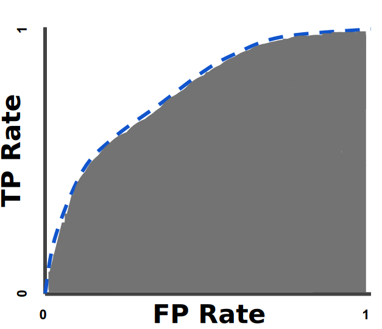
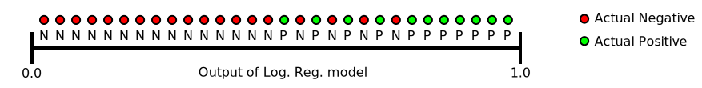
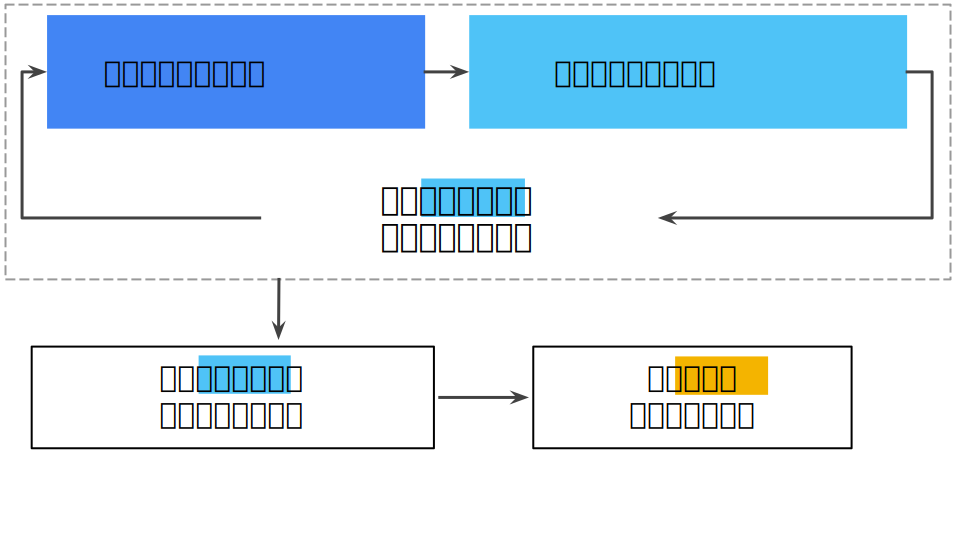

# 深度学习（神经网络）

***TODO: 目前分类杂乱，先将知识点罗列整理，后续再加以分类***

**todo list glossary**
+ 预处理 -> 缩放 -> 帮助梯度下降更快的收敛 **WHY**

#### 神经网络并不是一个新的概念，不过，得益于近些年大数据的发展，机器性能的提升，神经网络的能力得到展现，开始成为人工智能领域的主力军。

#### 提纲
+ loss
  + 交叉熵
  + MSE
+ metrics 评价指标
+ optimizer
+ 梯度下降
+ 正则化
+ 全连接网络
+ 残差网络
+ 卷积网络
+ batch-normalize / BN
+ 1 x 1 卷积
+ 注意力机制
+ 监督
+ 自监督
+ 迁移学习
+ 强化学习
+ 生成对抗网络
+ 循环网络
+ 分类
+ 回归
+ 图像识别
+ 图像检测
+ 图像分割
+ C3D 
+ one-hot编码
+ 词袋模型
+ 论文 
+ 征引

# 正文

## 评价指标

### 分类器的评价指标

***

#### 混淆矩阵 confusion matrix

以二分类为例：

***

#### Accuracy, Recall, Precison, Specificity, F1
#### 准确率，召回率，精度，特异度，F1, F$\bm{_\beta}$

$Accuray = \frac{(TP + TN)}{(TP + TN + FN + TN)}$

$Recall = \frac{TP}{TP + FN}$

$Precision = \frac{TP}{TP + FP}$

$Specificity = \frac{TN}{TN + FN}$ 

$F1 = \frac{2 \times (Precision \times Recall)}{Precision + Recall}$

>关于F1：
>F1是Precision和Recall的调和平均数(倒数算术平均数的倒数),
>调和平均数的特点是强调小元素，忽略大元素。
>如果一个分类器的F1很高，则该分类器的Precision和Recall一定同时很高。
>如果Recall很大，Precision很小，那么F1的值也是很小的
>极端来说，如果Recall=1，Precision=0，此时F1=0

$F_\bm{\beta} = \frac{((1 + (\beta)^{2}) \times (Precision \times Recall)}{((\beta)^{2} \times Precision) + Recall}$

$F_\bm{\beta}$的使用场景出现在，当你对Precision和Recall中某一个指标更感兴趣时。如果你更看重Precision，那么$\bm{\beta}$的值应该小于1，如果你更看重Recall，那么$\bm{\beta}$的值应该大于1.

***

#### ROC
Receiver Operating Characteristic Curve
最初是为军事雷达接收器的操作者设计的，所以如此命名。

横坐标为 伪阳性率(FPR, False Positive Rate)
$FPR = \frac{FP}{N} = \frac{FP}{FP + TN}$

纵坐标为 真阳性率(TPR，Ture Positive Rate)(Recall)
$TPR = \frac{TP}{P} = \frac{TP}{TP + FN}$

ROC曲线用于绘制采用不同分类阈值时的TPR与FPR。降低分类阈值，会有更多样本被划分为Positive.假正例与真正例都会增加。所以曲线从左向右呈现攀升趋势。
理想情况下，ROC曲线为一点 (0, 1)
<!--  -->

#### AUC
Area Under the Curve
<!--  -->

曲线下面积对所有可能的分类阈值的效果进行综合衡量。曲线下面积的一种解读方式是看作模型将某个随机正类别样本排列在某个随机负类别样本之上的概率。

>理论公式如下:
>$$TPR(T): T \rightarrow y(x)$$
>$$FPR(T): T \rightarrow x$$
>
>$T$为选取的阈值，$X_1$为一个随机正例的预测得分，$X_0$为一个随机负例的预测得分。$f_1, f_0$分别是正例和负例的概率密度。

以下面的样本为例，逻辑回归预测从左到右以升序排列：

曲线下面积表示随机正类别（绿色）样本位于随机负类别（红色）样本右侧的概率。
曲线下面积的取值范围为 0-1。预测结果 100% 错误的模型的曲线下面积为 0.0；而预测结果 100% 正确的模型的曲线下面积为 1.0。

##### AUC的计算
+ 根据古典概率模型
  $AUC = \frac{\sum{(sign(pred_{pos} - pred_{neg})} / 2 + 0.5)}{positiveNum \times negativeNum}$
  即，统计所有可能的组合情况（两两组合）
+ Rank
  $AUC = \frac{\sum_{ins_i\in{positiveClass}}{rank_{ins_i}-\frac{M\times(M+1)}{2}}}{M\times N}$
  $rank_{ins_i}$: 概率得分从小到大排序，正样本$ins_i$在排序后的排名
  $M, N$: 分别是正样本和负样本的个数
  
  注：对于概率相等的样本，他们的$rank$统一为他们的$rank$均值

>关于 Rank 方法
从小到大排序后，第一个正样本的位置（rank，假设从0开始），就是其比负样本得分大的个数；对于第二个正样本，前面有已经1个正样本了，所以负样本个数为rank减1，同理，第三个正样本前面的负样本个数为位置减去2，以此类推，对于第M个正样本，匹配的负样本个数为位置序号减去(M-1)。 故而，分子就变成: 所有正样本的位置序号和，减去$(0+1+2+\dots+M-1)=M*(M-1)/2$.
若序号从1开始，则减数为：$(0+1+2+\dots+M-1)=M*(M-1)/2$

***
#### AP, mAP

***
#### Log loss - Cross entropy
用于**分类**(**逻辑回归**)（逻辑回归的输出为概率，这使得我们联想到Log loss与概率之间的关系）

> **逻辑回归**
> 逻辑回归在输出层加入S型函数，将输出映射到[0,1]的概率空间。
> 典型的S型函数如下：
> $$y^{\prime}=\frac{1}{1+e^{-z}}$$

**熵**：信息论中，一个随机变量的熵衡量它具有的"信息"量（不确定性）
一个随机变量$X$,具有可能的取值$x_1, \dots, x_n$,对应的取值概率分别为$P(x_1), \dots, P(x_n)$,则$X$的熵为：

$H(x)=-\sum_{i=1}^{n}{P(x_i)log_bP(x_i)}$

**交叉熵**：
假设$p, q$是具有相同取值范围的两个离散概率分布，则$p, q$的交叉熵为：

$H(p,q)=H(p)+D_{KL}(p||q)=-\sum_{x \in \chi}{p(x)logq(x)}; \chi 为取值范围$

机器学习二分类问题下可以写成如下形式：
$H(y,p)=-(ylogp + (1-y)log(1-p))$

>两种角度看待交叉熵
从似然函数角度看，最大化似然函数就是交叉熵
从分布角度来看，我们希望最小化模型输出与训练集标签之间的分布差异，当我们用KL散度来度量分布时，即是最小化$D_{KL}(p||q)$,考虑到$H(p)$是常量，最小化$D_{KL}$,也就是最小化$H(p,q)$

>分类问题中，使用cross entropy 相比于 MSE 的优点：
使用MSE计算loss，loss的曲线是波动的，有很多局部的极值点，是一个非凸优化问题，不利于梯度下降
而cross entropy 作为loss，依然是一个凸优化问题，梯度下降时，具有很好的收敛特性。

***
#### 最大似然概率

***
#### 马尔可夫模型

***
### 回归任务的评价指标

#### MSE 均方差
均方误差 (MSE) 指的是每个样本的平均平方损失。要计算 MSE，需要求出各个样本的所有平方损失之和，然后除以样本数量。
$$MSE=\frac{1}{N}\sum_{(x,y)\in D}{(y-prediction(x))^2}$$
其中
+ $(x,y)$指的是样本，其中
  + $x$指的是模型进行预测时使用的特征集（例如，温度、年龄和交配成功率）。
  + $y$指的是样本的标签（例如，每分钟的鸣叫次数）。
+ $prediction(x)$指的是权重和偏差与特征集$x$结合的函数,可看作$f(x)$。
+ $D$指的是包含多个有标签样本的数据集。
+ $N$指的是$D$中的样本数量。

虽然 MSE 常用于机器学习，但它既不是唯一实用的损失函数，也不是适用于所有情形的最佳损失函数。

***
#### 范数
我们这里说的**特指$L_p$范数**

$$p=-\infty : ||\vec x||_{-\infty}=\lim_{p\rightarrow -\infty}(\sum_{i=1}^{n}|x_i|^p)^{1/p}=\min_{i}|x_i|$$
$$p=0: ||\vec x||_0=\sharp(i), with x_i \neq 0, \ i.e.向量中不为零的元素个数$$
$$p=1: ||\vec x||_1 = \sum_{i=1}^{n}|x_i|,\ i.e. 向量各分量绝对值之和，又称曼哈顿距离$$
$$p=2: ||\vec x||_2 =\sqrt{\sum_{i=1}^{n}{|x_i|^2}},\ i.e. 欧氏距离$$
$$p=+\infty : ||\vec x||_{+\infty}=\lim_{p\rightarrow +\infty}(\sum_{i=1}^{n}|x_i|^p)^{1/p}=\max_{i}|x_i|$$

***
#### 正则化
正则化的出现是为了抑制模型的过拟合

以线性模型为例，用多项式拟合目标函数时，多项式的最高次数越大，训练集loss越小，但测试集loss反而可能增大，此时出现了过拟合。这也同样印证了奥卡姆剃刀理论，模型越复杂，越可能出现过拟合。
使用正则化抑制参数的值，理想情况下，它使得多项式中高次数的项的系数趋于0，从而降低模型复杂度，也即抑制了过拟合

另一种情形是，模型迭代次数过多，学习了过多训练集样本的特定特征，从而产生过拟合。如下图：

现在，我们不仅以最小化loss为目标，我们以同时最小化loss和模型复杂度为目标。而模型复杂度的表示项即为我们的正则化项。

##### L2正则化
L2正则化是一种常用的正则化项，其定义为所有特征权重的平方和：
$$L_2\ regularization\ term=||\omega||_2^2=\omega_1^2+\omega_2^2+\dots + \omega_n^2$$

在这个公式中，接近于 0 的权重对模型复杂度几乎没有影响（可以理解为模型近似去除了该参数,**需要注意的是，L2正则化可以使权重变小，但是并不能使它们正好为0.0**），而值较大权重则可能会产生巨大的影响
加入L2正则化后，模型在训练中会倾向于偏好参数较小的模型，从而降低模型复杂度。

##### L1正则化
L1正则项可以使得部分权重正好为0.0

> 注：**为什么L2正则项不能是权重为0.0**
> * 举例而言，L2正则项中关于权重$\omega_i$为$\omega_i^2$,其导数（梯度）为$2\omega_i$,这意味着，每次更新权重，$\omega_i$都改变自身比例的某个值$step\times 2\omega_i=(1-step\times 2)\omega_i$，所以权重可能会接近0，但永远不会真正为0.0（除非$step=0.5$，或是$\omega_i$在更新后太大或太小，导致计算机float类型越界）
> * 而L1正则项的梯度为常数，权重每次减去一个常数，当更新后由大于零的状态变为小于零的状态，该权重就被置零。

> 注：
> **L1正则项有利于得到稀疏解，L2正则项有利于得到平滑解。**

##### Lambda系数
可以通过在正则化项前添加Lambda系数来控制正则化强度。

在选择 lambda 值时，目标是在简单化和训练数据拟合之间达到适当的平衡：
+ 如果您的 lambda 值过高，则模型会非常简单，但是您将面临数据欠拟合的风险。您的模型将无法从训练数据中获得足够的信息来做出有用的预测。

+ 如果您的 lambda 值过低，则模型会比较复杂，并且您将面临数据过拟合的风险。您的模型将因获得过多训练数据特点方面的信息而无法泛化到新数据。

> 注：将 lambda 设为 0 可彻底取消正则化。 在这种情况下，训练的唯一目的将是最小化损失，而这样做会使过拟合的风险达到最高。

##### 早停法
另一种正则化方法，在训练损失仍可以继续降低之前就结束模型训练。一般在验证集的损失开始增大（也就是泛化效果变差）时结束模型训练。

***
### 梯度, 学习速率
函数的梯度是偏导数相对于所有自变量的矢量，表示如下：
$$\nabla f$$
例如，如果：
$$f(x,y)=e^{2y}sin(x)$$
则：
$$\nabla f(x,y)=(\frac{\partial f}{\partial x}(x,y),\frac{\partial f}{\partial y}(x,y))=(e^{2y}cos(x),2e^{2y}sin(x))$$
> 注意
> $\nabla f$ 指向函数增长速度最快的方向
> $-\nabla f$ 指向函数下降速度最快的方向 
 
对于神经网络而言，每层的参数即为变量，模型的输入(样本)为常量，一般而言，在每个batch后，求出loss对参数的梯度，取负梯度方向按照一定的学习率更新参数，使得在给定输入(样本)的情况下，loss减小，循环迭代，找到使得训练集样本的loss最小的参数。

#### 学习速率 learning rate(lr)
梯度下降法算法用梯度乘以一个称为学习速率（有时也称为步长）的标量，以确定下一个点的位置。例如，如果梯度大小为 2.5，学习速率为 0.01，则梯度下降法算法会选择距离前一个点 0.025 的位置作为下一个点。

学习速率属于**超参数**
> 超参数
> 编程人员根据情况手动设置的模型参数，非模型自己学习的参数
> 包括，学习速率，模型深度等

如果选择的学习速率过小，每次参数的更新会很小，就会花费太长的学习时间
相反，如果指定的学习速率过大，下一个点将永远在 U 形曲线的底部左右弹跳
如果可以知晓损失函数的梯度较小，则可以放心地试着采用更大的学习速率，以补偿较小的梯度并获得更大的步长，从而加快模型的训练。

#### SGD 随机梯度下降
在原始的梯度下降法中，是在整个数据集上计算梯度，即将数据集中的每个样本输入模型，计算出整个数据集的loss，然后计算梯度，接着更新参数。然而，现实中，数据集往往非常庞大，计算一次梯度的时间/算力开销都很大。

由此，引出随机梯度下降法。

每次从数据集中随机选择一个样本，计算该样本在当前参数下的loss，得到梯度，更新模型参数，重复此过程，循环迭代。
SGD在更新参数过程中，由于某些样本可能存在噪声/偏差，导致该次梯度方向与总体目标方向存在偏差，使得梯度下降更新参数的过程变得杂乱。但只要进行足够多的迭代，梯度整体还是会朝向正确的方向更新参数。
“随机”这一术语表示构成各个批量的一个样本都是随机选择的。

由于SGD的下降过程杂乱，引入**batch SGD**的概念

小批量随机梯度下降法（小批量 SGD）是介于全批量迭代与 SGD 之间的折衷方案。小批量通常包含 10-1000 个随机选择的样本。小批量 SGD 可以减少 SGD 中的杂乱样本数量，但仍然比全批量更高效。

***
#### 奥卡姆剃刀
奥卡姆的威廉是 14 世纪一位崇尚简单的修士和哲学家。他认为科学家应该优先采用更简单（而非更复杂）的公式或理论。奥卡姆剃刀定律在机器学习方面的运用如下：
> 机器学习模型越简单，良好的实证结果就越有可能不仅仅基于样本的特性。

现今，奥卡姆剃刀定律已被正式应用于**统计学习理论**和**计算学习理论**领域。这些领域已经形成了泛化边界，即统计化描述模型根据以下因素泛化到新数据的能力：

> 模型的复杂程度
> 模型在处理训练数据方面的表现

#### 泛化
以下三项基本假设阐明了泛化：

+ 我们从分布中随机抽取独立同分布 (i.i.d) 的样本。换言之，样本之间不会互相影响。（另一种解释：i.i.d. 是表示变量随机性的一种方式）。
+ 分布是平稳的；即分布在数据集内不会发生变化。
+ 我们从同一分布的数据划分中抽取样本。

在实践中，我们有时会违背这些假设。例如：

+ 想象有一个选择要展示的广告的模型。如果该模型在某种程度上根据用户以前看过的广告选择广告，则会违背 i.i.d. 假设。
+ 想象有一个包含一年零售信息的数据集。用户的购买行为会出现季节性变化，这会违反平稳性。

如果违背了上述三项基本假设中的任何一项，那么我们就必须密切注意指标。

#### 训练集，验证集，测试集
将数据集划分为训练集和测试集。借助这种划分，您可以对一个样本集进行训练，然后使用不同的样本集测试模型。采用两种分类之后，工作流程可能如下所示：

在图中，“调整模型”指的是调整您可以想到的关于模型的任何方面，从更改学习速率、添加或移除特征，到从头开始设计全新模型。该工作流程结束时，您可以选择在测试集上获得最佳效果的模型。

但是当多次在测试集上进行测试，并根据测试集上的表现来调整模型，就意味着模型可能会**学到/猜到测试集的样本特征**，此时，测试集就不能代表模型的泛化效果。模型的效果也只能是在训练集和测试集构成的样本集上的特异化表现。

因而，我们需要引入**验证集**。

使用验证集评估训练集的效果。然后，在模型“通过”验证集之后，使用测试集再次检查评估结果。下图展示了这一新工作流程：

在这一经过改进的工作流程中：

+ 选择在验证集上获得最佳效果的模型。
+ 使用测试集再次检查该模型。

该工作流程之所以更好，原因在于它暴露给测试集的信息更少。测试集的效果更能反应模型的泛化能力。

> 注:
> 不断使用测试集和验证集会使其逐渐失去效果。也就是说，使用相同数据来决定超参数设置或其他模型改进的次数越多，您对于这些结果能够真正泛化到未见过的新数据的信心就越低。请注意，验证集的失效速度通常比测试集缓慢。
> 如果可能的话，建议收集更多数据来“刷新”测试集和验证集。

***
## 预处理
***良好的机器学习依赖于良好的数据。对数据的预处理往往比预计的更重要。***
### One Hot
将字符串映射到数字表示

样本的某个特征可能是字符串形式的离散变量。举例而言，可能有一个名为 street_name 的特征，其中的选项包括：

{'Charleston Road', 'North Shoreline Boulevard', 'Shorebird Way', 'Rengstorff Avenue'}

由于模型不能将字符串与学习到的权重相乘，需要将字符串映射为数字。

最直观的一个想法是构建一个词汇表，表中规定了特征取值到整数的映射。另外，将词汇表之外的取值定义为 OOV（out of vacabulary）。

通过这种方法，我们可以按照以下方式将街道名称映射到数字：

将 Charleston Road 映射到 0
将 North Shoreline Boulevard 映射到 1
将 Shorebird Way 映射到 2
将 Rengstorff Avenue 映射到 3
将所有其他街道 (OOV) 映射到 4

然而，这种方法显然存在问题。

+ 假设，我们学习到对于 street_name 的一个参数的权重为 6，那么对于 Charleston Road，我们会将其乘以 0，对于 North Shoreline Boulevard 则乘以 1，对于 Shorebird Way 则乘以 2，依此类推。以某个使用 street_name 作为特征来预测房价的模型为例。根据街道名称对房价进行线性调整的可能性不大，此外，这会假设您已根据平均房价对街道排序。我们的模型需要灵活地为每条街道学习不同的权重，这些权重将添加到利用其他特征估算的房价中。
+ 我们没有将 street_name 可能有多个值的情况考虑在内。例如，许多房屋位于两条街道的拐角处，因此如果模型包含单个索引，则无法在 street_name 值中对该信息进行编码。

由此，引入one hot/ multi-hot 编码

创建一个长度等同词汇表大小的向量，对每个样本，将向量中对应元素位置置1，其他位置置0

当只有一个值为 1 时，这种表示法称为One Hot编码；当有多个值为 1 时，这种表示法称为Multi-Hot编码。

> #### **特征组合**
> 在实践中，机器学习模型很少会组合连续特征。不过，机器学习模型却经常组合One Hot特征矢量，将独热特征矢量的特征组合视为逻辑连接。
> 假设我们具有以下两个特征：国家/地区和语言。对每个特征进行独热编码会生成仅具有0,1元素的二元矢量，这些二元特征可解读为 country=USA, country=France 或 language=English, language=Spanish。然后，如果您对这些独热编码进行特征组合(相乘,笛卡尔乘积)，则会得到可解读为逻辑连接的二元特征，如下所示：
> country:usa AND language:spanish

#### 特殊值
##### 实际数据内不要掺入特殊值
良好的浮点特征不包含超出范围的异常断点或特殊的值。例如，假设一个特征具有 0 到 1 之间的浮点值。那么，如下值是可以接受的：

> quality_rating: 0.82
> quality_rating: 0.37

不过，如果用户没有输入 quality_rating，则数据集可能使用如下特殊值来表示不存在该值：

> quality_rating: -1

为解决特殊值的问题，需将该特征转换为两个特征：

> 一个特征只存储质量评分，不含特殊值。
> 一个特征存储布尔值，表示是否提供了 quality_rating。为该布尔值特征指定一个名称，例如 is_quality_rating_defined。

#### 数据缩放
如果某个特征集只包含一个特征，则缩放可以提供的实际好处微乎其微或根本没有。不过，如果特征集包含多个特征，则缩放特征可以带来以下优势：

+ 帮助梯度下降法更快速地收敛。（**why**）
+ 帮助避免“NaN 陷阱”。在这种陷阱中，模型中的一个数值因为过大或过下而变成 NaN（例如，当某个值在训练期间超出浮点精确率限制时），并且模型中的所有其他数值最终也会因数学运算而变成 NaN。
+ 帮助模型为每个特征确定合适的权重。如果没有进行特征缩放，则模型会对范围较大的特征投入过多精力。

事实上，并**不需要**对每个浮点特征进行**完全相同**的缩放。即使特征 A 的范围是 -1 到 +1，同时特征 B 的范围是 -3 到 +3，也不会产生什么恶劣的影响。不过，如果特征 B 的范围是 5000 到 100000，模型可能会出现糟糕的响应。

##### 缩放方法
> 一种显而易见的方法是将 [最小值，最大值] 以线性方式映射到较小的范围，例如 [-1，+1]。
> 另一种热门的缩放策略是计算每个值的 Z score。Z score与距离均值的标准偏差相关。换而言之：
> 例如，给定以下条件：
> 均值 = 100
> 标准偏差 = 20
> 原始值 = 130
> 则：
    
    scaled_value = (130 - 100) / 20
    scaled_value = 1.5

>使用 Z 得分进行缩放意味着，大多数缩放后的值将介于 -3 和 +3 之间，而少量值将略高于或低于该范围。

#### 离群值
对于极端的离群值，可以采用取对数或是直接限制范围的方法
> 限制范围
> 比如，将数据范围限制为[-5, 5],那么任意大于5的值都被认定为5，同样，小于-5的值被认定为-5

#### 分箱
下面的曲线图显示了加利福尼亚州不同纬度的房屋相对普及率。注意集群 - 洛杉矶大致在纬度 34 处，旧金山大致在纬度 38 处。

每个纬度的房屋数曲线图。曲线图极其不规则，在纬度 36 左右出现低谷，并在纬度 34 和 38 左右出现巨大峰值。

在数据集中，latitude 是一个浮点值。不过，在我们的模型中将 latitude 表示为浮点特征没有意义。这是因为纬度和房屋价值之间**不存在线性关系**。例如，纬度 35 处的房屋并不比纬度 34 处的房屋贵 35/34（或更便宜）。但是，纬度或许能很好地预测房屋价值。

为了将纬度变为一项实用的预测指标，我们对纬度“分箱”，如下图所示：

我们现在拥有 11 个不同的布尔值特征（LatitudeBin1、LatitudeBin2、…、LatitudeBin11），而不是一个浮点特征。拥有 11 个不同的特征有点不方便，因此我们将它们统一成一个 11 元素矢量。这样做之后，我们可以将纬度 37.4 表示为：

    [0, 0, 0, 0, 0, 1, 0, 0, 0, 0, 0]

分箱之后，我们的模型现在可以为每个纬度学习完全不同的权重。

> **分箱的方法**
> 为了简单起见，我们在纬度样本中使用整数作为分箱边界。如果我们需要更精细的解决方案，我们可以每隔 1/10 个纬度拆分一次分箱边界。添加更多箱可让模型从纬度 37.4 处学习和维度 37.5 处不一样的行为，但前提是每 1/10 个纬度均有充足的样本可供学习。
> 另一种方法是按分位数分箱，这种方法可以确保每个桶内的样本数量是相等的。按分位数分箱完全无需担心离群值。

***
## 神经网络

#### 激活函数 。。。
如果没有激活函数，单纯的叠加神经网络层数（全连接），得到的只是一个复杂的线性网络，只能描述输入与输出之间的线性关系，等同于线性回归。

为了描述真实世界里更为广泛的非线性关系，引入非线性的激活函数。

假设$\sigma$表示我们的激活函数（ReLU、S 型函数等等）, 则网络中节点的值可由以下公式指定：
$$\sigma(w\cdot x + b)$$

**Sigmoid函数**
$$F(x)=\frac{1}{1+e^{-x}}$$

**tanh函数**
$$tanh(x) = 2sigmoid(2x) - 1,\ -\infty<x<+\infty, \ -1<tanh(x)<1$$
从图形上看，tanh是对sigmoid进行了变换: 水平方向压缩，垂直方向拉伸

tanh与sigmoid形式类似，优点是中心区域梯度更不容易消失

**ReLU函数**
$$F(x)=max(0,x)$$

ReLU 的优势在于它拥有更实用的响应范围。S 型函数的响应性在两端相对较快地减少。

***
## 反向传播中存在的注意点

### 梯度消失
较低层（更接近输入）的梯度可能会变得非常小。在深度网络中，计算这些梯度时，可能涉及许多小项的乘积。
当较低层的梯度逐渐消失到 0 时，这些层的训练速度会非常缓慢，甚至不再训练。

> 以sigmoid激活函数为例，sigmoid(x)关于x的导数的值域为[0,0.2]; 网络每加深一层，每多一层激活层，第$j$层第$i$个权重$\omega_i^j$在反向传播时都会多乘以一次[0, 0.2]的梯度（链式求导法则），该权重的梯度都会变小。

ReLU 激活函数有助于防止梯度消失。

### 梯度爆炸 。。。
如果网络中的权重过大，则较低层的梯度会涉及许多大项的乘积。在这种情况下，梯度就会爆炸：梯度过大导致难以收敛。

**Batch Normalization(BN)** 可以降低学习速率，因而有助于防止梯度爆炸。

### Batch Normalization (BN) 。。。
... ...

### ReLU 单元消失
一旦 ReLU 单元的加权和低于 0，ReLU 单元就可能会停滞。它会输出对网络输出没有任何贡献的 0 激活，而梯度在反向传播算法期间将无法再从中流过。由于梯度的来源被切断，ReLU 的输入可能无法作出足够的改变来使加权和恢复到 0 以上。

降低学习速率有助于防止 ReLU 单元消失。

### Drop Out(丢弃正则化) 。。。
随机丢弃某些网络单元，这样做的好处是：
1. 降低模型复杂度
2. 相当于训练了多个模型（丢弃不同的cell，形成了不同的网络结构），最终的输出是多个模型的组合结果。而我们知道，联合多个模型的好处是，抑制单个模型学习到的特异化知识，从而提高泛化能力。
   
通常设置一个丢弃比例：
* 0.0 = 无丢弃正则化。
* 1.0 = 丢弃所有内容。模型学不到任何规律。
* 0.0 和 1.0 之间的值更有用。

***
## 多分类任务

### Softmax
**逻辑回归**可生成介于 0 和 1.0 之间的小数。例如，某电子邮件分类器的逻辑回归输出值为 0.8，表明电子邮件是垃圾邮件的概率为 80%，不是垃圾邮件的概率为 20%。很明显，一封电子邮件是垃圾邮件或非垃圾邮件的概率之和为 1.0。

Softmax 将这一想法延伸到多类别领域。也就是说，在多类别问题中，Softmax 会为每个类别分配一个用小数表示的概率。这些用小数表示的概率相加之和必须是 1.0。
与其他方式相比，这种附加限制有助于让训练过程更快速地收敛。

Softmax 方程式如下所示：
$$p(y=j|x) = \frac{e^{w^T_jx+b_j}}{\sum_{k\in K}e^{w^T_kx+b_k}}$$
请注意，此公式**本质上是将逻辑回归公式延伸到了多类别**。

#### Softmax 变种
* **Full Softmax** 是我们一直以来讨论的 Softmax；也就是说，Softmax 针对每个可能的类别计算概率。

* **候选采样**指 Softmax 针对所有正类别标签计算概率，但仅针对负类别标签的随机样本计算概率。例如，如果我们想要确定某个输入图片是小猎犬还是寻血猎犬图片，则不必针对每个非狗狗样本提供概率。

类别数量较少时，完整 Softmax 代价很小，但随着类别数量的增加，它的代价会变得极其高昂。候选采样可以提高处理具有大量类别的问题的效率。

> **注意多标签分类情况**
> Softmax **假设每个样本只是一个类别的成员**。但是，一些样本可以同时是多个类别的成员。对于此类示例：
> * 不能使用 Softmax。
> * 必须依赖多个逻辑回归。

### 词袋模型。。。

### 协同过滤（推荐任务）
协同过滤是一项可以预测用户兴趣（根据很多其他用户的兴趣）的任务。以**影片推荐任务**为例，假设我们有 100 万个用户，以及每位用户观看过的影片的列表（可供观看的影片共有 50 万部）。 我们的目标是向用户推荐影片。

我们首先假设，用户可能感兴趣的影片和我们已经了解到他所感兴趣的影片在某些特征上是类似的（前者是我们的求解目标，后者是我们通过用户观看记录或者评分而定义的数据集）。所以现在的问题转化为将影片embedding到某个维度空间，使得具有相似特征的影片之间的距离更近（思想类似于聚类）。

> Embedding
> 抽取特征，映射到某个维度空间。

举例而言，我们尝试将一些影片示例投影到二维空间（embedding为二维向量）
如下图所示：

利用这种二维嵌套，我们可以定义影片之间的距离，从而使在适宜儿童或成人的程度上相近的影片以及属于大片或艺术影片的程度上相近的影片位于相近的位置。当然，这只是影片诸多重要特征中的两个。

更笼统地来说，我们所做的是将这些影片映射到一个嵌套空间，其中的每个字词都由一组二维坐标来表示。例如，在这个空间中，《怪物史莱克》映射到了 (-1.0, 0.95)，而《蓝》则映射到了 (0.65, -0.2)。通常情况下，在学习 d 维嵌套时，每部影片都由 d 个实值数字表示，其中每个数字都分别表示在一个维度中的坐标。

在此示例中，我们为每个维度指定了名称。在学习嵌套时，每个维度的学习跟它们的名字无关。有时我们可以查看嵌套并为维度赋予语义，但有时则无法做到这一点。通常，每个此类维度都称为一个潜在维度，因为它代表的特征没有明确显示在数据中，而是要根据数据推断得出。

最终，真正有意义的是嵌套空间中各个影片之间的距离，而不是单个影片在任意指定维度上的坐标。

***
#### Reference
+ [谷歌机器学习教程](https://developers.google.com/machine-learning/crash-course/classification/roc-and-auc)
+ [sklearn reference](https://scikit-learn.org/stable/modules/classes.html#module-sklearn.metrics)
+ [wikipedia](https://en.wikipedia.org/wiki/Receiver_operating_characteristic)
+ [ML Glossary](https://ml-cheatsheet.readthedocs.io/en/latest/index.html)
+ [知乎](https://www.zhihu.com)

## More Reading
+ **Understand transformation in hidden layer:**
[Neural Networks, Manifolds, and Topology](https://colah.github.io/posts/2014-03-NN-Manifolds-Topology/)

